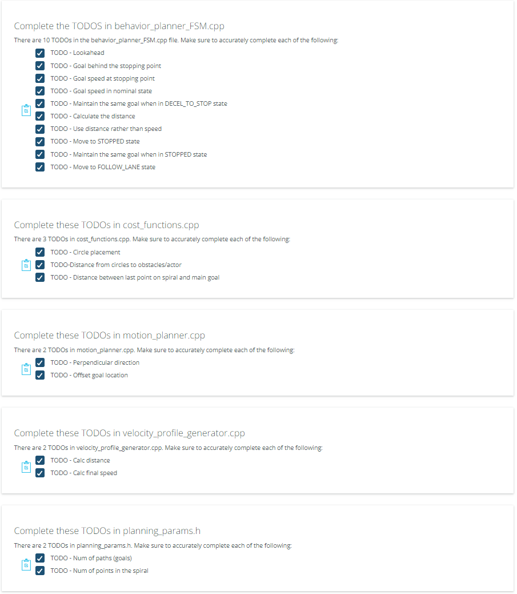

# Motion Planning and Desicion Making for Autonomous Vehicles

In this project a motion planning algorithm is implemented based on the code repo provided. The changes as stated on the Project steps are done.

As a result the following implementation with CARLA was developed.

